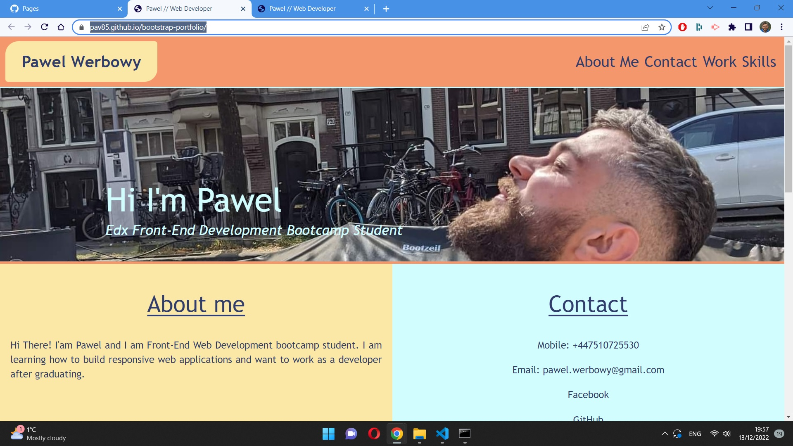

# Week 3 Edx Bootcamp challenge 

# bootstrap-portfolio

## Description

My portfolio webpage made with bootstrap. I modified my portfolio webpage from week 2's challenge by adding bootstrap components. 

My recreated portfolio page contains:

### A navigation bar

* navigation bar has a menu at the top that include links that navigate to my portfolio sections

### A hero section 

* bootstrap jumbotron component with my picture and my name and short description of myself

### An about and contact me 

* an about me and contact section in the same row

### work section

* section displaying my work in grid
* each of the projects is a bootstrap card component
* each card has a title when clicked taking to the GitHub Repository
* each card has a brief description 
* each has a button which takes the user to deplyed webpage

### Skills section

* list of skills I would like to have at the end of the bootcamp

### A footer section

* hyperlinks have a hover effect
* buttons display a box shadow upon hover

## Installation 

 After opening this url:"https://pav85.github.io/bootstrap-portfolio/" you should see this:
 

## Usage 

When deployed the website's tab will have a descriptive title. When opening browser's console there will be clear and visible comments in html and css file describing the changes in the code.

## Credits 

N/A

## Licence 

MIT Licence

 

